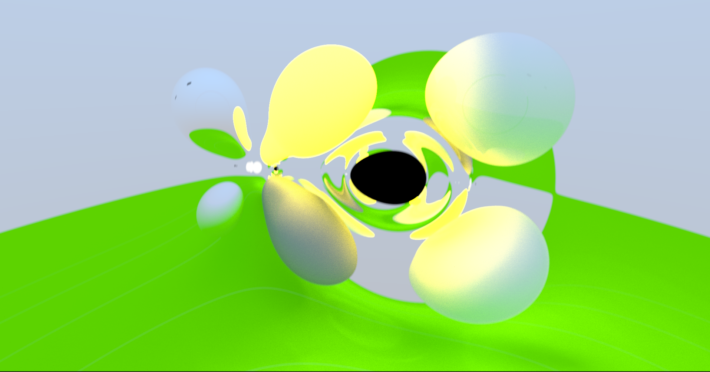
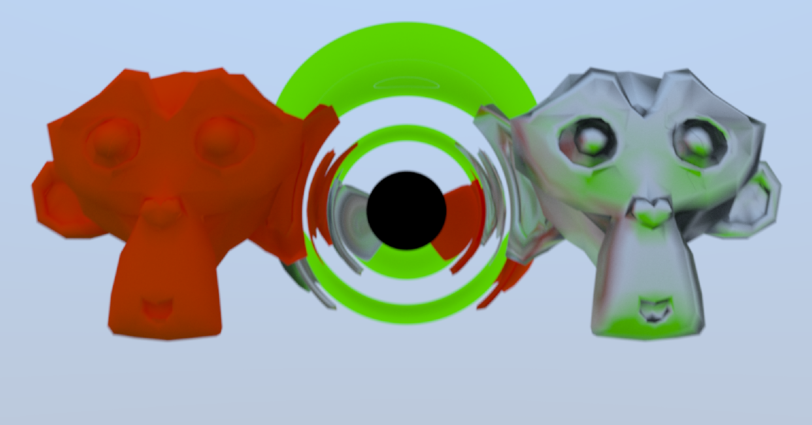

### Disclaimer: I made this for my final project in my Intro to Computer Graphics course (CS334), so I probably won't maintain this any more than pushing an initial commit.

# RayTracing with Attractors
Behold my experiments with raytracing in curved space. I made heavy use of [Ray Tracing in One Weekend](https://raytracing.github.io/) and [How to Build a BVH](https://jacco.ompf2.com/2022/04/13/how-to-build-a-bvh-part-1-basics/), as well as being generally inspired by [Sebastian Lague's RayTracing Video](https://www.youtube.com/watch?v=Qz0KTGYJtUk).

